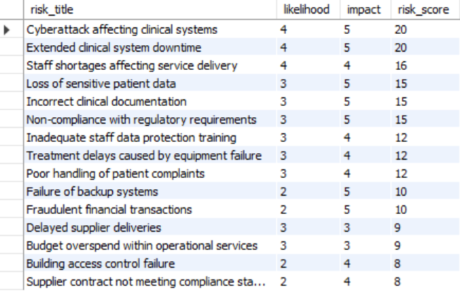
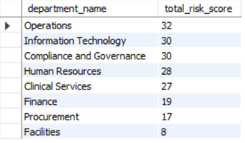
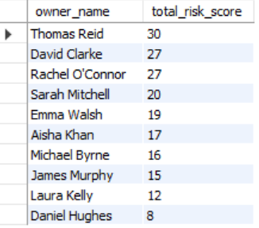

# Enterprise Risk Register SQL Analysis

> Using SQL to prioritise enterprise risks, monitor controls and support informed organisational decision-making.

---

## About This Project

This project demonstrates how SQL can be applied to enterprise risk management by analysing organisational risks, mitigation controls, ownership and review activity.

Unlike many SQL portfolio projects that focus on sales or customer data, this project models a realistic enterprise risk register similar to those used within healthcare organisations, public services and other highly regulated industries.

The database was designed from scratch to simulate a practical governance environment and demonstrate how SQL can support strategic risk reporting and decision-making.

---

## Project Objectives

This project demonstrates how SQL can be used to:

- Identify high-priority organisational risks
- Calculate and classify risk scores
- Monitor mitigation controls
- Analyse departmental and owner accountability
- Support executive-level reporting
- Strengthen governance and compliance decision-making

---

## Database Structure

The project consists of five related tables:

- 🏢 Departments
- 👤 Risk Owners
- ⚠️ Risks
- 🛡 Controls
- 📋 Risk Reviews

The database was designed to model a realistic enterprise risk register with clearly defined ownership, controls and review processes.

---

## SQL Skills Demonstrated

Throughout this project I applied:

- Database Design
- CREATE TABLE
- Primary & Foreign Keys
- Data Modelling
- INSERT Statements
- SELECT
- CASE Expressions
- Aggregate Functions
- GROUP BY
- HAVING
- INNER JOIN
- Common Table Expressions (CTEs)
- Window Functions
- Risk Scoring
- Executive Reporting

---

## Business Questions Answered

The analysis addresses practical governance questions such as:

- Which organisational risks require immediate attention?
- Which departments have the greatest overall risk exposure?
- Which risk owners manage the highest cumulative risk?
- Which controls remain incomplete?
- Which actions require escalation?
- Which risks should appear on an executive risk dashboard?

## 📊 Example SQL Analysis

### Risk Scoring

The project calculates a risk score using the likelihood × impact methodology to support prioritisation.

---

### Department Risk Exposure

SQL aggregation was used to identify departments carrying the highest cumulative organisational risk.

---

### Risk Ownership Dashboard

This report highlights risk ownership and accountability by identifying owners responsible for the greatest cumulative risk exposure.

---

## Executive Summary

The SQL analysis demonstrates how a static enterprise risk register can be transformed into meaningful management information.

By combining risk scoring, ownership, departmental accountability and control monitoring, the project highlights areas requiring attention while supporting governance, compliance and organisational resilience.

The reporting approach reflects how SQL can be used to assist management teams in prioritising risks and monitoring mitigation activities within complex organisations.

---

## Learning Journey

This repository reflects my practical SQL learning journey alongside my MSc in Health Informatics and clinical background.

The project intentionally progresses from fundamental SQL concepts towards more advanced analytical techniques.

The later sections introduce concepts that represent the next stage of my SQL development, including:

- Common Table Expressions (CTEs)
- Window Functions
- Advanced CASE logic
- Risk scoring methodologies
- Executive reporting
- Analytical SQL design

To strengthen my understanding, I continue developing these skills through structured SQL study, technical documentation and practical exercises using resources such as GeeksforGeeks alongside extensive hands-on practice within MySQL Workbench.

Rather than simply completing tutorials, my goal is to apply newly learned concepts within realistic healthcare, governance and business scenarios. I believe documenting this progression provides an honest reflection of both my current capability and my commitment to continuous professional development.

---

## Future Improvements

Potential future developments include:

- Interactive Power BI executive dashboard
- Risk trend analysis over time
- SQL Views for recurring reports
- Stored Procedures for automated reporting
- Query optimisation using indexes
- Python integration for predictive risk analysis

---

## Technologies Used

- MySQL Workbench
- SQL
- Git
- GitHub

---

## 👩‍⚕️ About Me

I have a clinical background in dental nursing and recently completed an MSc in Health Informatics.

I enjoy applying data analytics to solve practical problems across service-delivery, governance and digital transformation, with a particular interest in using data to support better operational and strategic decision-making.

This repository forms part of my growing analytics portfolio as I continue developing practical skills in SQL, data analysis and health informatics.

---

⭐ Thank you for taking the time to explore this project. Feedback, suggestions and opportunities to continue learning are always welcome.

---
